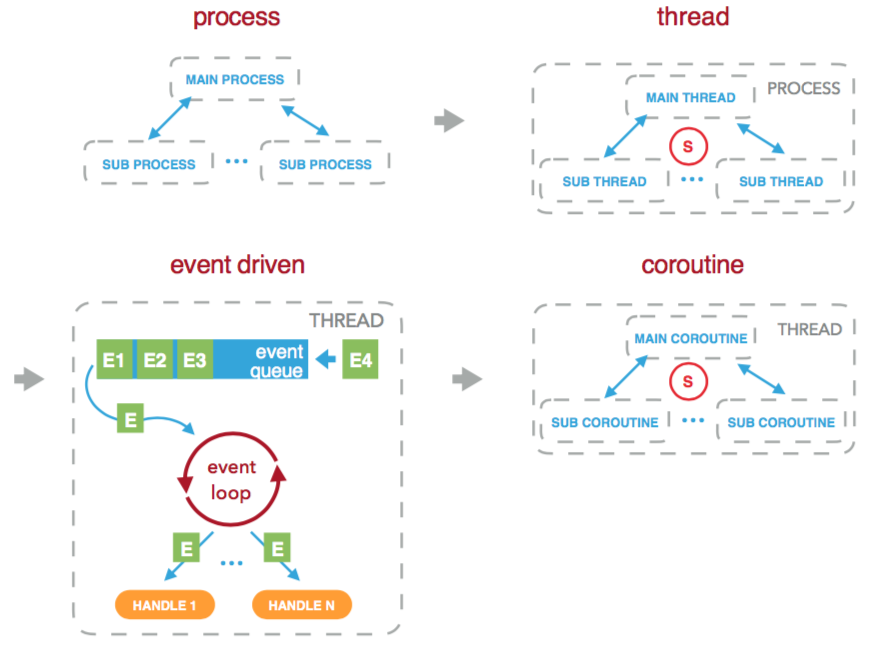
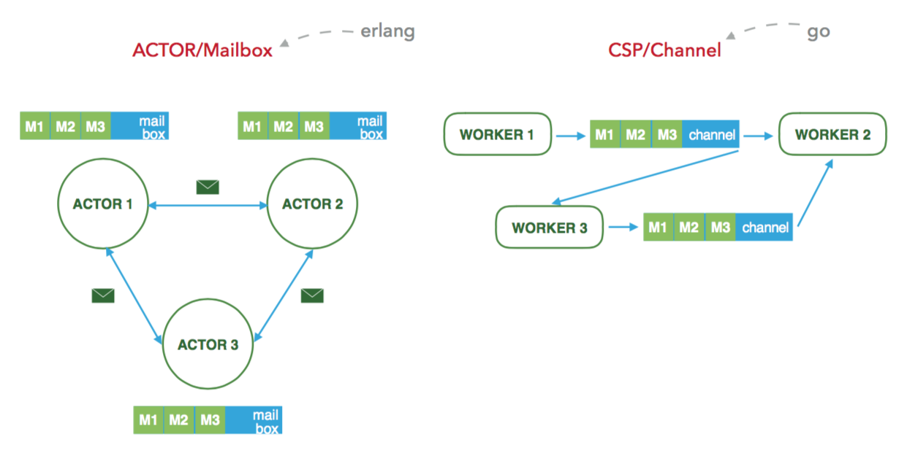

# coro

> **IMPORTANT**
>
> 1. We say libtask/context, which means any codes that has some relations with `ucontext_t`, developed by Russ Cox in his project [libtask]()
> 2. In any amd64 structure(macOS for example), `makecontext` has to be passed 2 or a greater number for the third parameter, or the program will be crashed by segment fault(caused by `*(int*)0 = 0`). See more details in `context.c`.
> 3. Field `uc_link` of `struct ucontext_t` seems to not work at least in amd64 structure for some unknown reasons(maybe because `struct libthread_ucontext` is exactly the same as `struct ucontext_t` or `struct __ucontext_t`), so never merely use return whenever you want to exit from some contexts, instead, you have to manually invoke `swapcontext`.

[TOC]

## 1 Overview of coroutine

### 1.1 Features

1. less-cost: scheduling of coroutines occurs in user-space, which is much less expensive than threads.
2. stateful: a coroutine can hold state.
3. no-race-condition: there is only one coroutine at a specific time.
4. nonpreemptive: nobody can prevent a coroutine from running, except that, the coroutine comes across an IO operation, or the coroutine itself yields cpu actively.

### 1.2 In the frontend

An elegant solution for asynchronous tasks.


### 1.3 In the backend

A concurrent model for IO-bound tasks.



### 1.4 Communication

There are two commonly used models: the ACTOR model and the CSP, which uses Mailbox and Channel as their communication manners respectively.



## 2 coro

### 2.1 Overview

#### 2.1.1 Motivation

`coro` is a tiny coroutine framework for C in macOS, who provides an easy-to-use apis, of which the number is as fewer as possible. It uses the mailbox as its communication model and uses poll/epoll when comes across IO operation.

#### 2.1.2 Project overview

```
.
├── Makefile                 # makefile
├── README.md
├── example                  # examples you can use to learn
├── lib                      # dependencies
└── src
    ├── coro.c               # fundamental functionalities implementation
    ├── coro.h               # api for coroutine and communication
    ├── def.h                # fundamental definitions
    ├── io.c                 # io implementation
    ├── io.h                 # api for io
    ├── mailbox.h            # definitions for mailbox
    └── main.c               # entry of this project

6 directories, 25 files
```

### 2.2 Compilation

In the root path of `coro`, you can compile the examples(`easy_coro`/`easy_delay`/`easy_io`/`easy_ping_pong`/`ping_pong`/`fibonacci`) and then run them just by type:

```bash
make easy_coro && ./easy_coro
make easy_delay && ./easy_delay
make easy_io && ./easy_io
make easy_ping_pong && ./easy_ping_pong
make ping_pong  && ./ping_pong
make fibonacci && ./fibonacci
```

you can check their source code and learn how to use `coro` in the `example` folder.

### 2.3 Usage

### 2.3.1 API

`coro` is devoted to providing apis as fewer as possible. All apis are listed as follows:

```c
/*----------------------------------------------------------------------------
                                    coroutine
  ----------------------------------------------------------------------------*/

/**
 * coro_t represents an executable coroutine
 */
typedef int coro_id_t;

/**
 * coro_ex_t is the function executed by coroutine
 */
typedef void* (*coro_ex_t)(void*);

/**
 * CORO_EX defines a coro_ex_t
 * @param  ex_name name of this coro_ex_t
 * @param  ex_args args of this coro_ex_t
 * @return         definition of this coro_ex_t
 */
#define CORO_EX(ex_name, ex_args) void* ex_name(void *ex_args)

/**
 * coro creates and queues a coroutine of ex, does not run immediately
 * @param ex   exeutable function
 * @param args args of ex
 * @return     id of this coroutine
 */
coro_id_t coro(coro_ex_t ex, void *args);

/**
 * yield yields CPU to other coroutines, just like the key word `yield` 
 * in ECMA2015+ or python.
 */
void yield();

/**
 * delay makes coroutine delay executing for at least time ms
 * @param time sleeping time(millisecond), negative or 0 means yield
 */
void delay(long long time);

/**
 * self returns id of this coroutine
 * @return id of this coroutine
 */
coro_id_t self();

/*----------------------------------------------------------------------------
                                    messaging
  ----------------------------------------------------------------------------*/

/**
 * coro_msg_t represents the message used for coroutine's communication
 */
typedef struct coro_msg_t {
  coro_id_t  from; // sender
  coro_id_t  to;   // receiver
  int        type; // type of this message, positive for valid ones else invalid
  void      *data; // data of this message
} coro_msg_t;

/**
 * send sends a message to cid
 * @param  cid  id of the receiver
 * @param  type message type
 * @param  data message data
 * @return      0 when succeeded else -1
 */
int send(coro_id_t cid, int type, void *data);

/**
 * receive receives a message from other coroutine: 
 *  if there is a message, then return immediately;
 *  else if timeout > 0, then blocked until there is a message within timeout;
 *  else if timeout = 0, then return immediately;
 *  else blocked until there is a message
 * @param  timeout blocked time(millisecond)
 * @return         message received(or the message type will be a negative number)
 */
coro_msg_t receive(long long timeout);

/*----------------------------------------------------------------------------
                                       IO
  ----------------------------------------------------------------------------*/

/**
 * coro_io_set_nonblock makes fd non-blocking
 * @param  fd file descriptor
 * @return    -1 if there are errors
 */
int coro_io_set_nonblock(int fd);

/**
 * coro_io_read read nbyte bytes data from fd to buf non-blockingly, 
 * during which, cpu will be automatically yielded
 * @param  fd    file descriptor
 * @param  buf   buffer to put data
 * @param  nbyte bytes to read
 * @return       bytes that is read
 */
ssize_t coro_io_read(int fd, void *buf, size_t nbyte);

/**
 * coro_io_write writes nbyte bytes data from buf to fd non-blockingly,
 * during which, cpu will be automatically yielded
 * @param  fd    file descriptor
 * @param  buf   buffer where data is put
 * @param  nbyte bytes to write
 * @return       bytes that is written
 */
ssize_t coro_io_write(int fd, const void *buf, size_t nbyte);
```

### 2.3.2 Examples

The necessary files of `coro` is in the folders `src` and `lib`, and all other files maybe redundant to your project. Therefore you can just copy the necessary files into your own project or just write your test/try-out codes in the folder example.

The common routine of using `coro` is:

1. statically create some coroutines using the api `CORO_EX` which can communicate with others, including starting other coroutines using the api `coro`, reading/writing data using the api `coro_io_read`/`coro_io_write`(before reading or/and writing data, you **have to** open a file, and set it into a nonblock state using `coro_io_set_nonblock`) respectively, sending to/receiving messages from other coroutines using the api `send/receive` respectively, yielding using `yield`, and sleeping using `delay`.
2. write a main method, namely `coro_main`, to dynamically handle the coroutines created in 1, using the api `coro`.

Let's go through a relatively complex example - fibonacci, which you can treat as a producer and consumer example.

#### 2.3.2.1 producer: main_task

`main_task` is a producer, who generates the fibonacci numbers, and send it the consumer(`fib_writer`) which we will elaborate on next. Given that `main_task`  is a cpu-bound task, you have to yield actively, or the consumer will get scheduled only after `main_task` is done.

Firstly `main_task` starts `fib_writer`, gets `fib_writer`'s handler, and passes the its own handler to it. Handlers are used in communication:

```c
coro_id_t fib_writer_id = coro(fib_writer, (void*)self()); // start fib_writer
```

Once successfully creating a fib number, `main_task` will send it to `fib_writer`:

```c
arg = fib_arg_create(idx, fib); // create a fib number

if (send(fib_writer_id, MSG_WRITE_ONE, (void*)arg) < 0) { // send it to fib_writer
  fprintf(stderr, 
          "error while main_task is sending [%d, %lld] to fib_writer %d\n", 
          idx, fib, fib_writer_id);
  return NULL;
} else { // failed
  fprintf(stdout, 
          "main_task sent [%d, %lld] to fib_writer %d\n",
          idx, fib, fib_writer_id);
}
```

Given that `main_task`  is a cpu-bound task, it has to yield actively:

```c
// cpu-bound task will never yield its cpu automatically,
// so we yield manually
if (0 == idx % MAX_ONCE) {
  yield();
}
```

Then, `main_task` sends a special message to `fib_write` to terminate the communication:

```c
if (send(fib_writer_id, MSG_WRITE_OVER, NULL) < 0) {
  fprintf(stderr, 
          "error while main_task is sending MSG_WRITE_OVER to"
          " fib_writer %d\n",
          fib_writer_id);
  return NULL;
} else {
  fprintf(stdout, 
          "main_task sent MSG_WRITE_OVER to fib_writer %d\n",
          fib_writer_id);    
}
```

Last, remember to `return NULL` whenever your want to exit:

```c
return NULL; // exit the coroutine
```

#### 2.3.2.2 consumer: fib_writer

`fib_write` acts similarly like `main_task`, all explanations are written in the comment:

```c
CORO_EX(fib_writer, args) {
  coro_id_t main_task_id = (coro_id_t)args; // args(the handler) are passed from main_task

  int fd = open("./fib.txt", O_WRONLY|O_CREAT, 00666);
  char buf[128];

  if (coro_io_set_nonblock(fd) < 0) { // IMPORTANT! remeber to set it to nonblock before any read/write operations
    fprintf(stderr,
            "error while fib_writer is setting fd %d to O_NONBLOCK\n",
            fd);
    return NULL;
  }

  do {
    coro_msg_t m = receive(-1); // waits until the messages sent by main_task arrives

    if (MSG_WRITE_ONE == m.type) { // write it to file
      fib_arg_t *a = (fib_arg_t*)m.data;

      int       idx = a->idx;
      long long fib = (a->fib_l32) | ((long long)(a->fib_h32) << 32);
      fib_arg_destroy(a);

      int len = sprintf(buf, "%d: %lld\n", idx, fib);

      if (coro_io_write(fd, buf, len) < 0) { // write it to fd; this is an IO operation, when the kernel is busy, fib_writer will be scheduled into the `delayed` state
        fprintf(stderr, 
                "error while fib_writer is writing [%d, %lld] to fd %d\n",
                idx, fib, fd);
        close(fd); // remember to close it
        break;
      } else {
        fprintf(stdout, "fib_writer wrote [%d, %lld]\n", idx, fib);
      }
    } else if (MSG_WRITE_OVER == m.type) { // terminate
      close(fd); // remember to close it
      break;
    } else {
      close(fd); // remember to close it
      fprintf(stderr, 
              "error while fib_writer is receiving"
                " message of type %d from coro %d\n",
              m.type, m.from);
      break;
    }

  } while(1);

  return NULL; // exit
}
```

#### 2.3.2.3 coro_main

`coro` is a framework, rather than a library, therefore you have to obey the rules created by it:

> **You must use a main function (named and prototyped) `int coro_main(int argc, char *argv[]),` as the entry of `coro`, which you can treat as the commonly used `int main(int argc, char *argv[])` !!!**

Therefore in the bottom of `example/fibonacci.c`, there is a `coro_main` to dynamically create and start the coroutine `main_task` using `coro`.

#### 2.3.2.4 run it

you can compile and run it in the root path by typing:

```bash
make fibonacci && ./fibonacci
```

### 2.3 Lifecycle


Like the figure shows, there are 6 different state for a coroutine:

- [ *READY* ]  a coroutine enters *READY* immediately after it is firstly scheduled(by  `coro`)
- [ *ACTIVE* ]  a coroutine enters *ACTIVE* when it is picked as the current running coroutine, from the suspended/ready queue.
- [ *SUSPENDED* ]  a coroutine enters *SUSPENDED* when a delayed task is done, or the coroutine itself yields its cpu.
- [ *DELAYED* ]  a coroutine enters *DELAYED* whenever an IO operation is executing and the kernel is busy, or the coroutine itself delays for a while.
- [ *ZOMBIE* ]  a coroutine enters *ZOMBIE* when the task assigned to it is completed, but hasn't yet deleted by the framework.
- [ *DEAD* ]  a coroutine enters *DEAD* when it is deleted by the framework.